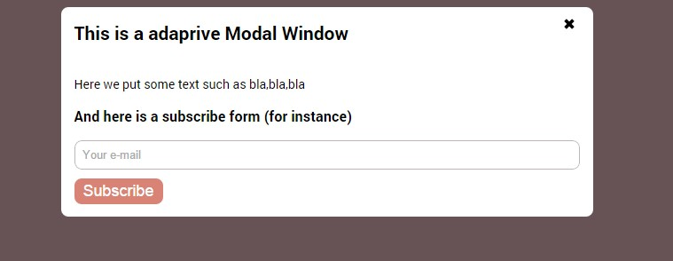

# Adaptive Modal Window 
> IE8 compatible

Supported effects:

- Slide from left ``slideFromLeft``
- Fade and scale up ``fadeInScaleUp``
- Slide from bottom ``slideFromBottom``
- Old fashion rotate ``oldRotate``
- Uncover ``uncover``

## How to create and init modal window

Snippet code Javascript:
```javascript
var modal = new APP.Modal({
  containerClass: 'modal', // modal window container
  effect: 'uncover' // effect
});

modal.init();
```
Other options
```javascript
var modal = new APP.Modal({
  containerClass: 'modal-window', // container class
    closeBtn: true, // add close button
    overlay: true, // add overlay 
    overlayClassOpen: 'modal-window-overlay--open', // only for CSS rules
    overlayClass: 'modal-window-overlay', // for CSS rules only
    closeBtnClass: 'btn btn-modal--close', // for CSS rules only
    openBtnClass: 'btn btn-modal--open', //  for CSS rules only
    effect: 'uncover' // what effect use for modal window
});

modal.init();
```


Snippet code HTML:
```html
<!-- name of modal window -->
<div class="modal">
  <!-- container of content -->
    <div class="modal-content">
      <!-- content goes here -->
  </div>
</div>
```

